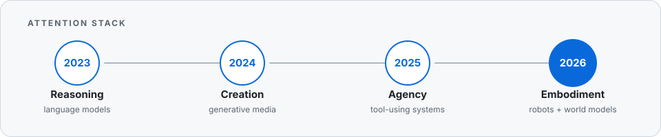

# Mohamed Sobhy

> I am most drawn to intelligence that can perceive, reason, create, use tools, and act in the physical world. My work spans human-motion recovery, motion retargeting, robot data collection, generative policies, simulation, and deployment.

**CS & Robotics @ HKUST** · Hong Kong

[LinkedIn](https://www.linkedin.com/in/mohamed-sobhy-morsi/) · [X](https://x.com/mohamedsobhi777)

<picture>
  <source media="(prefers-color-scheme: dark)" srcset="./assets/attention-stack-dark.svg">
  <source media="(prefers-color-scheme: light)" srcset="./assets/attention-stack-light.svg">
  
</picture>

## Current focus

- **Embodied intelligence** — recovering and retargeting human motion for scalable robot data.
- **Generative control** — policies that learn actions from multimodal demonstrations.
- **Systems** — simulation, data pipelines, evaluation, and real-world deployment.
- **Interfaces** — agents and spatial tools for directing increasingly capable models.

## Selected work

| Project | What it explores |
| --- | --- |
| [OpenMarble](https://github.com/mohamedsobhi777/OpenMarble) | A spatial-computing experiment that turns a single image into an explorable 3D Gaussian-splat world. |
| [ENGINEER-1](https://github.com/mohamedsobhi777/ENGINEER-1) | An AI engineering agent that designs physical products through OpenSCAD and an iterative feedback loop. |
| [Sentinel](https://github.com/mohamedsobhi777/Sentinel) | A multi-agent intelligence system that turns signals from GitHub, Product Hunt, and social platforms into founder briefs. |
| [Generative Art Independent Study](https://github.com/mohamedsobhi777/COMP4971C---Independent-Study-Project) | An HKUST study using generative deep-learning models to synthesize and examine digital artwork. |

## Background

- Worked across machine-learning research, startup building, robotics, and product engineering.
- Researched steer-decoding algorithms for language models at ETH Zürich's SRI Lab.
- Co-founded Morpha to build computer-vision systems for manufacturers.
- Built with the HKUST Robotics Smart Car team and competed with HKUST's championship-winning CSE programming team.

I am happiest close to the whole loop: **new capabilities → useful systems → deployment → feedback from the real world**.
